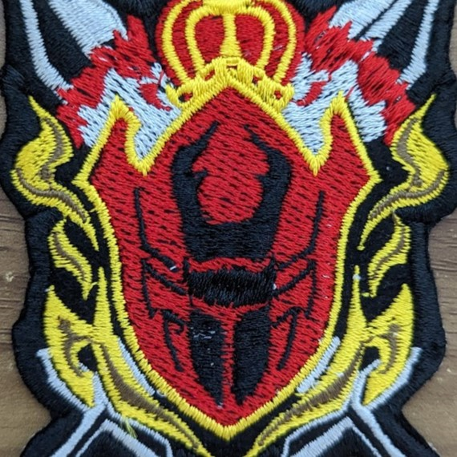

# recordName

> This is the feed's ID which can be letters, numbers, or dashes. Spaces are not allowed. Maximum length is 15 characters.

king-ohger

# displayName

> This is the title of the custom feed. Maximum length is 24 characters.

キングオージャー専用フィード

# description

> This is the description of the feed.

王様戦隊キングオージャーに関するキーワードを拾います。

# searchTerms

> There are three types of search terms:
>
> - Keywords: Test these in [https://bsky.app/search](https://bsky.app/search). `AND` is implicit, so `cat dog` on one line will require both `cat` and `dog`. You can use quotes as well `"hot dog"`.
> - Users: links such as `https://bsky.app/profile/why.bsky.team` will pull in the user's posts. To include replies and reposts, you can add the following flags: `https://bsky.app/profile/why.bsky.team +replies +reposts`.
> - Pinned posts: links such as `https://bsky.app/profile/saddymayo.bsky.social/post/3jxju2wwap22e` will pin at the top of the feed. One link per line, please.

- 王様戦隊
- キングオージャー
- ギラ
- ハスティー
- クワガタオージャー
- キングクワガタオージャー
- ヤンマ
- トンボオージャー
- ヒメノ
- カマキリオージャー
- カグラギ
- ディボウスキ
- ハチオージャー
- リタ
- パピヨンオージャー
- もっふん
- ジェラミー
- ブラシエリ
- スパイダークモノス
- シュゴッダム
- コーカサスカブト城
- ラクレス
- オオクワガタオージャー
- ドゥーガ
- ボシマール
- コガネ
- ブーン
- ゴローゲ
- ンコソパ
- ペタ城
- シオカラ
- アッカ
- ウスバ
- マユタ
- イシャバーナ
- フラピュタル城
- セバスチャン
- エレガンス
- ゴッカン
- ザイバーン城
- モルフォーニャ
- トウフ
- タキタテ城
- クロダ
- スズメ
- スズメ・ディボウスキ
- オージャカリバー
- キングズウエポン
- キングズホットライン
- キングスピーダー
- クモノスレイヤー
- ヴェノミックスシューター
- スパイダークモノスキー
- クモノスキーホルダー
- オージャクラウン
- オージャクラウンランス
- シュゴッド
- ゴッドクワガタ
- クワゴン
- ゴッドトンボ
- ゴッドカマキリ
- ゴッドハチ
- ゴッドパピヨン
- ゴッドクモ
- ゴッドテントウ
- ゴッドアント
- ゴッドカブト
- カブタン
- ゴッドスコーピオン
- サソリーヌ
- すこピ
- ゴッドホッパー
- ゴッドタランチュラ
- タランチュラナイト
- バグナラク
- デズナラク
- カメジム
- ゲロウジーム
- ネフィラ
- ベダリア
- コフキ
- ライニオール
- デボニカ
- イロキ
- ダグデド
- ゴーマ
- ヒルビル
- ミノンガン

# safeMode

> Safe mode limits the total number of API calls coming from Cloudflare.
>
> Set to `false` if you have higher limits via a paid Cloudflare plan.

true

# avatar

> This must link to an image (PNG or JPEG) in the same directory as this CONFIG.md. It doesn't have to be called `avatar.png`, but just be sure this CONFIG.md points to the correct file.

